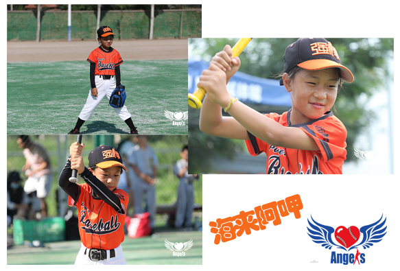
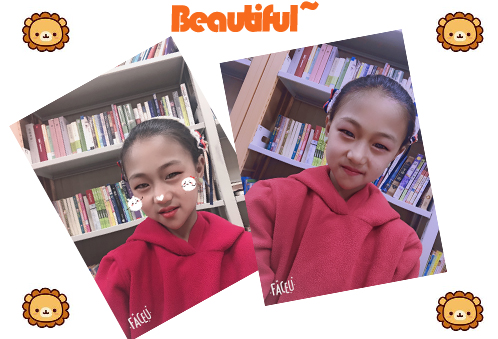
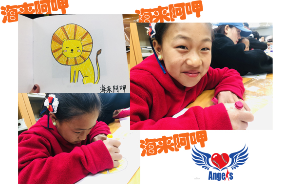

---
layout: post
title:  "强棒女孩——海来阿呷，Yes OK"
image: assets/images/1-0.jpg
--- 
#### 猜猜我是谁😊
大家好呀，我是总眯着眼睛笑，干活麻利、细心的关注队员需求、热心帮助他人的**海来阿呷**

我出生于2010年8月12日，老家在四川凉山州，我是彝族，在2019年的12月加入强棒基地，想认识我吗？嘿嘿~

****  

#### 充满阳光的我🌞
* 我喜欢打棒球，也喜欢跳皮筋~ 看**我打棒球的样子看起来是不是很酷**😜  
  * 虽然打棒球过程中也有受过伤，但**因为喜欢所以坚持**，每日坚持棒球训练，我的梦想可是成为一名***棒球选手***🧭  
  * 我跳皮筋也还可以，新的跳皮筋玩法我也能很快学会，嘻嘻~😊  

  
* 别看我打棒球很酷，我平时也是一个爱美的小姑娘呢，梳好头发，别上好看的卡子，FACE U镜头下的我真好看👩  

 
* 还有，平时在基地也会画画，我画画也蛮好看的哦，你往下瞅瞅，我可不是自夸~🦁  

  

***

#### 我所在的强棒基地🏏
强棒基地有我很多爱笑、爱棒球、坚持不懈的小伙伴，以及关爱我们的教练/老师，我很喜欢我的小伙伴们，我还会给阿牛梳头发呢~  

这里还有宿舍、食堂（有专业的营养师呢）、有训练场地、图书馆，还有丰富的课外活动，能让我们在各种活动中增长见识，学习传统文化知识，有更多认识世界的机会

>强棒基地由前国家棒球队队长孙岭峰与爱心人士联合筹资建设，创建中国第一支公益棒球队。基地主要资助对象为全国范围内 7-10 岁困境儿童，通过专业的棒球技能获得职业发展方向和未来的就业机会。截止到 2020 年11月，项目共资助困境儿童80名，其中女孩 26名，多数儿童来自四川大凉山彝族自治州。通过基地的学习训练，她们重拾了信心也对未来建立目标，部分孩子通过努力训练走向了更大的舞台，获得了更多人的关注和认可。  
2019年12月，第一批女孩入驻强棒天使基地，至今已有26名女孩，最小的6岁，最大14岁。25个来自四川大凉山的彝族姑娘。她们分别组成了U10和U12年龄组，是中国第一支女子棒球队。
